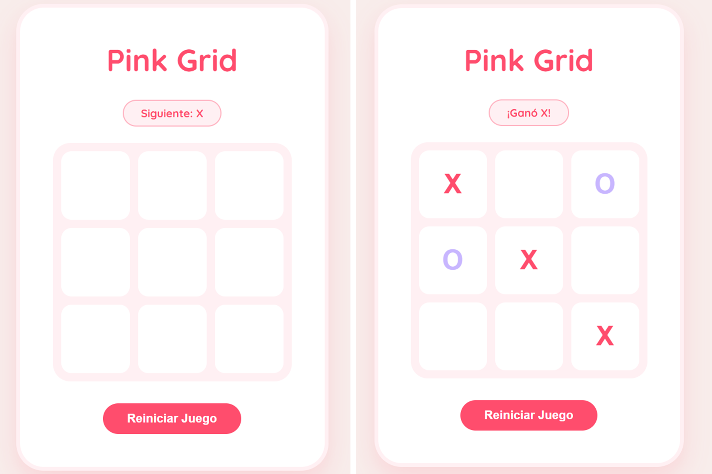

# Ta-Te-Ti 

¡Bienvenido/a! Este es un clásico juego de **Ta-Te-Ti** (Tic-Tac-Toe) desarrollado con un enfoque en el diseño UI/UX y la interactividad. El proyecto busca combinar una estética **"soft & girlie"** con una arquitectura de código moderna y eficiente.

## Características Especiales
- **Estética Personalizada:** Interfaz diseñada con una paleta de colores rosa pastel y lavanda, pensada para ser visualmente atractiva y coherente.
- **Diseño 100% Responsive:** Optimizado para una experiencia cómoda tanto en ordenadores como en dispositivos móviles (botones adaptables y fáciles de tocar).
- **Desarrollado con Vue 3:** Uso de la *Composition API* para un manejo de estado reactivo y limpio.
- **Detalles Pro:** Incluye Favicon personalizado y prevención de selección de texto para una sensación de "App nativa".

## Tecnologías Utilizadas
- **Vue.js 3** (Framework principal)
- **Vite** (Herramienta de construcción rápida)
- **CSS3** (Flexbox, Grid, Media Queries y variables personalizadas)
- **JavaScript (ES6+)**

## Cómo ejecutarlo localmente
1. Clona este repositorio:
   ```bash
   git clone [https://github.com/TU_USUARIO/nombre-del-repo.git](https://github.com/TU_USUARIO/nombre-del-repo.git)

